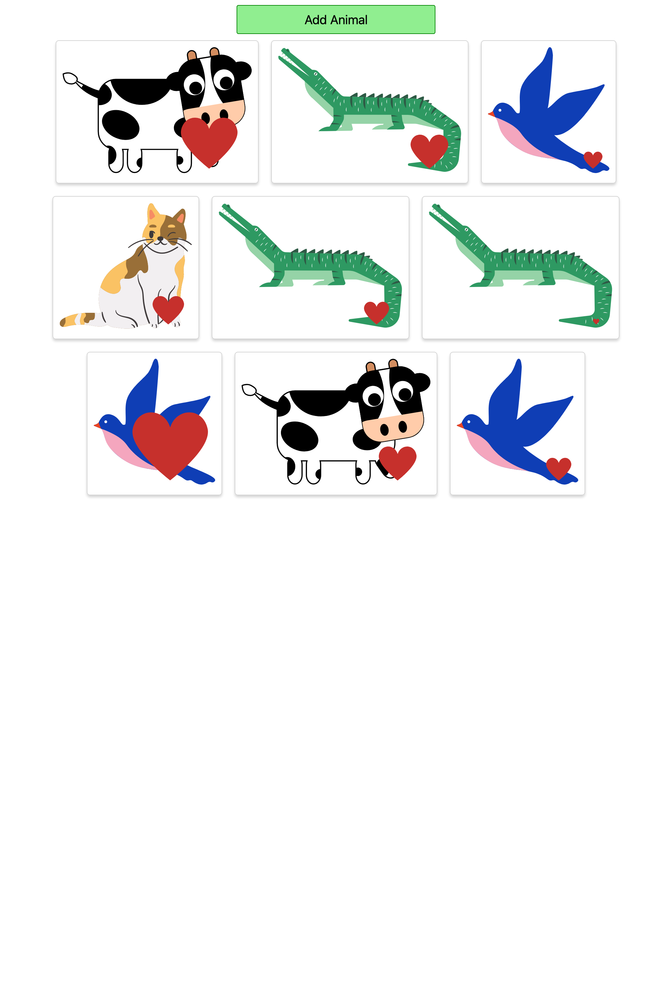

# Random Animal Generator App

## Overview

This project is a simple, fun, and interactive React application that allows users to add random animal images to their screen with a click of a button. Each animal added comes with a heart symbol which increases in size each time you click on the animal. This app is excellent for learning and understanding key concepts of React such as state management, event handling, and passing data to child components via props.

## Features 

- *Add Animal Button*: A simple button that, when clicked, adds a random animal to your screen.
- *Interactive Hearts*: Each animal image added comes with a heart symbol. Clicking on the animal increases the size of its heart, adding a level of interactivity to the app.
- *Unlimited Animals*: There's no limit to the number of animals you can add given within a set of predefined array of animals. The more, the merrier!

## Technologies Used

- React.js: For building the user interface
- CSS: For styling the components

## Usage

### Screenshot

### Link

[animal-show-app]()

## Useful Insight

- *State Management*: This project uses React's useState hook for managing the state of the animals and the size of the hearts.
- *Event Handling*: The app allows users to interact with the animals by clicking on them to increase the size of their hearts. This teaches the fundamental concept of event handling in React.
- *Props*: This project extensively uses props to pass data from parent components to child components.

## Conclusion

This project serves as a fun and interactive way to learn and understand the core concepts of React.js. Happy coding!